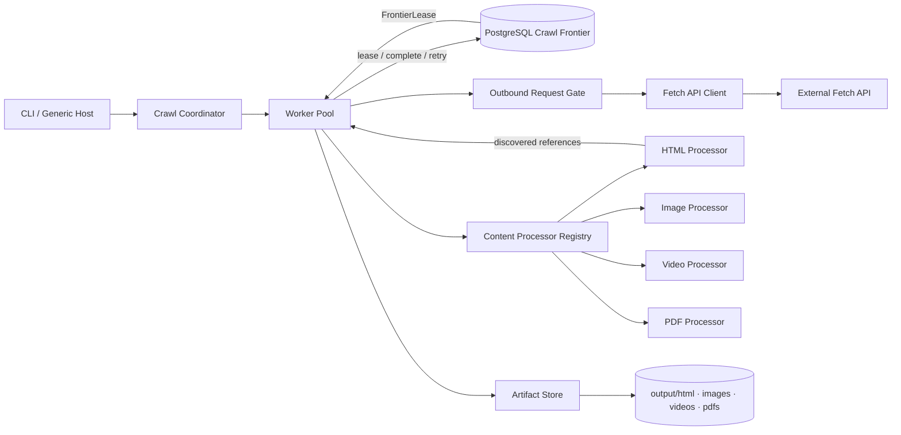
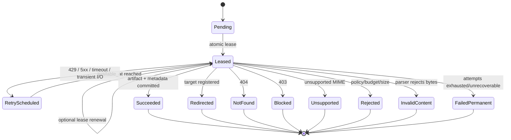

# BrightCrawler Architecture

## 1. Architecture decision

Build the crawler as a **pragmatic clean modular monolith** on .NET 10.

The production solution contains only three projects:

- `BrightCrawler.App` — executable host and composition root;
- `BrightCrawler.Core` — crawl workflow, frontier contracts, policies, and domain models;
- `BrightCrawler.Infrastructure` — PostgreSQL, Fetch API, filesystem, rate control, and content processors.

PostgreSQL acts as the **durable crawl frontier** and source of truth. Workers lease eligible URLs directly from PostgreSQL. There is no in-memory work queue, Redis, RabbitMQ, Kafka, MediatR, generic repository, or hidden HTTP retry pipeline.

This is intentionally smaller than a textbook Clean Architecture template. It preserves only the boundaries that protect correctness or enable a required extension.

## 2. Requirement-to-design mapping

| Assignment requirement | Architectural response |
|---|---|
| Seed URL and same-site crawling | Conservative URL canonicalization plus exact-host scope policy |
| Process each logical URL once under concurrency | Unique canonical URL identity per run plus exclusive lease token |
| HTML, images, videos, PDFs | MIME-based `IContentProcessor` registry with four implementations |
| Add a fifth content type without rewriting handlers | New processor + DI registration; orchestration remains unchanged |
| Persist state in a database | PostgreSQL stores runs, frontier entries, attempts, results, hashes, and links |
| Resumability | Pending/retry/leased states and expired-lease recovery are durable |
| Rate control | Shared concurrency limit, token bucket, and `Retry-After` cooldown |
| Failure handling | Explicit terminal/transient outcome policy and persisted retry schedule |
| Observability | Structured logs, attempt history, frontier snapshots, and `status` command |
| Separate output directories | Content-addressed artifact paths below the four required roots |
| Lean implementation | One process, one database, one filesystem volume, focused parsing libraries only |

## 3. Core terminology

### Crawl frontier

The crawl frontier is the crawler's **durable scheduling component**. It knows:

- which canonical URLs have been discovered;
- which URLs are eligible now;
- which URLs are leased to workers;
- which URLs are deferred until a retry time;
- which URL should be selected next;
- whether the crawl has any unfinished work.

It is more than FIFO `enqueue/dequeue`: selection considers state, availability time, depth, priority, attempts, and leases.

### Active frontier versus crawl ledger

The same PostgreSQL table stores both concepts, but they are logically distinct:

```text
Active frontier
  Pending
  Leased
  RetryScheduled

Crawl ledger / terminal history
  Succeeded
  Redirected
  NotFound
  Blocked
  Unsupported
  Rejected
  InvalidContent
  FailedPermanent
```

The active frontier can grow or shrink. The set of known URL records usually grows monotonically during a run and remains as an inspectable ledger after completion.

### Why not call it only a queue?

A queue is one possible implementation mechanism. `Crawl Frontier` is the domain abstraction. PostgreSQL provides the queue-like atomic claim operation while also providing deduplication, retry scheduling, leases, history, and inspection.

## 4. System context



### Crawl coordinator

- creates or resumes a crawl run;
- starts the configured number of worker loops;
- monitors frontier completion;
- coordinates graceful cancellation;
- emits periodic progress.

It does not fetch, parse, or persist content itself.

### Worker loop

- leases the next eligible URL from the frontier;
- executes the single-URL pipeline;
- finalizes, retries, or terminates the leased entry;
- waits without busy-spinning when only future retries or active leases remain.

Workers claim directly from PostgreSQL. An intermediate `Channel<T>` would create a second non-durable frontier and unnecessary prefetch/recovery semantics.

### Crawl frontier

- registers the seed and newly discovered canonical URLs;
- deduplicates scheduling within a crawl run;
- atomically leases work to concurrent workers;
- schedules durable retries;
- reclaims expired leases;
- conditionally finalizes work with a fencing token;
- exposes a snapshot for progress and completion detection.

### Outbound request gate

- limits maximum concurrent requests;
- limits request start rate with a token bucket;
- applies a process-wide pause after `429 Retry-After`;
- accepts cancellation.

### Content processor registry

Selects one processor from normalized response `Content-Type`. URL extensions do not control dispatch.

### Artifact store

Writes raw bodies atomically to deterministic content-addressed paths and returns an artifact descriptor for the database transaction.

## 5. Dependency direction

```text
BrightCrawler.App
  ├── references BrightCrawler.Core
  └── references BrightCrawler.Infrastructure

BrightCrawler.Infrastructure
  └── references BrightCrawler.Core

BrightCrawler.Core
  └── references no project in the solution
```

`App` is the only composition root. `Core` does not know Npgsql, `HttpClient` wire details, filesystem paths, AngleSharp, MetadataExtractor, or PdfPig.

## 6. Solution layout

```text
BrightCrawler.sln
Directory.Build.props
Directory.Packages.props
global.json
compose.yaml
Dockerfile
README.md
ARCHITECTURE.md

src/
  BrightCrawler.App/
    Program.cs
    Commands/
      CrawlCommand.cs
      ResumeCommand.cs
      StatusCommand.cs
    Composition/
      ServiceRegistration.cs
    appsettings.json

  BrightCrawler.Core/
    Crawling/
      CrawlCoordinator.cs
      WorkerLoop.cs
      UrlProcessingPipeline.cs
    Frontier/
      ICrawlFrontier.cs
      FrontierEntry.cs
      FrontierEntryId.cs
      FrontierLease.cs
      FrontierState.cs
      FrontierSnapshot.cs
      CrawlCompletion.cs
      RetryPlan.cs
      TerminalOutcome.cs
    Policies/
      UrlCanonicalizer.cs
      CrawlScope.cs
      FetchOutcomePolicy.cs
      RetryPlanner.cs
      CrawlBudget.cs
    Content/
      IContentProcessor.cs
      ContentProcessorRegistry.cs
      ContentInput.cs
      ContentProcessingResult.cs
      DiscoveredReference.cs
      ContentKind.cs
    Fetching/
      IFetchClient.cs
      FetchResult.cs
    Storage/
      IArtifactStore.cs
      ArtifactDescriptor.cs
    RateControl/
      IOutboundRequestGate.cs
    Runs/
      CrawlRunId.cs
      CrawlRunDefinition.cs
      CrawlRunState.cs

  BrightCrawler.Infrastructure/
    Fetching/
      MockFetchApiClient.cs
    Persistence/
      PostgresCrawlFrontier.cs
      DatabaseInitializer.cs
      Sql/
        001_initial.sql
        ClaimNext.sql
    RateControl/
      OutboundRequestGate.cs
    Storage/
      FileSystemArtifactStore.cs
    Content/
      HtmlContentProcessor.cs
      ImageContentProcessor.cs
      VideoContentProcessor.cs
      PdfContentProcessor.cs

tests/
  BrightCrawler.UnitTests/
  BrightCrawler.IntegrationTests/
```

This is a target shape, not a demand to create empty types. Delete any abstraction that does not earn its place in the implementation.

## 7. Core frontier contract

Use a domain-shaped port rather than a CRUD repository:

```csharp
public interface ICrawlFrontier
{
    Task<CrawlRunId> CreateRunAsync(
        CrawlRunDefinition definition,
        CancellationToken cancellationToken);

    Task<FrontierLease?> TryLeaseNextAsync(
        CrawlRunId runId,
        string workerId,
        CancellationToken cancellationToken);

    Task CompleteSuccessAsync(
        FrontierLease lease,
        CrawlCompletion completion,
        IReadOnlyCollection<UrlDiscovery> discoveries,
        CancellationToken cancellationToken);

    Task CompleteRedirectAsync(
        FrontierLease lease,
        RedirectCompletion redirect,
        CancellationToken cancellationToken);

    Task ScheduleRetryAsync(
        FrontierLease lease,
        RetryPlan retry,
        CancellationToken cancellationToken);

    Task CompleteTerminalAsync(
        FrontierLease lease,
        TerminalOutcome outcome,
        CancellationToken cancellationToken);

    Task<FrontierSnapshot> GetSnapshotAsync(
        CrawlRunId runId,
        CancellationToken cancellationToken);
}
```

The implementation is named `PostgresCrawlFrontier`, not `CrawlerRepository` or `QueueService`.

The contract exposes valid state transitions. Callers cannot perform arbitrary `Update<TEntity>()` operations or bypass lease validation.

## 8. Single-URL processing pipeline

```text
FrontierLease
    ↓
Check cancellation and crawl budget
    ↓
Wait for OutboundRequestGate
    ↓
Fetch through IFetchClient
    ↓
Classify response with FetchOutcomePolicy
    ├── terminal outcome ───────────► CompleteTerminalAsync
    ├── transient outcome ──────────► ScheduleRetryAsync
    ├── redirect ───────────────────► CompleteRedirectAsync
    └── supported success
            ↓
       Select processor by MIME
            ↓
       Extract metadata/references
            ↓
       Canonicalize and scope-filter references
            ↓
       Persist artifact atomically
            ↓
       CompleteSuccessAsync in one DB transaction
```

Expected HTTP statuses are data, not exceptions. Exceptions represent unexpected technical failures such as transport faults, corrupted parser state, or database/storage failures; the pipeline maps known exceptions to explicit retry or terminal outcomes at the boundary.

## 9. Processing guarantees

The assignment's “at most once” requirement is expressed precisely:

- **URL identity:** one frontier entry exists per canonical URL per crawl run;
- **exclusive ownership:** at most one non-expired lease token is valid for an entry;
- **fenced finalization:** only the current lease token may commit success/retry/failure;
- **attempt semantics:** transient failures and expired leases may produce multiple fetch attempts;
- **logical completion:** a canonical URL reaches one terminal state;
- **replay safety:** artifact paths and completion operations are idempotent.

Strict exactly-once external fetching is not claimed. An HTTP call and a PostgreSQL transaction cannot be committed atomically. The design intentionally prefers resumability and safe replay over lost work.

## 10. Frontier state machine



A lease contains:

```text
frontier_entry_id
lease_token
worker_id
attempt_number
leased_at
lease_until
canonical_url
depth
```

`lease_token` is a fencing token. Every completion query includes it. A stale worker may finish local work, but it cannot commit a database result after its lease was reclaimed.

For the one-day implementation, configure a lease longer than the bounded fetch + processing timeouts plus a safety margin. Add periodic lease renewal only if long-running processing requires it.

## 11. URL identity and scope

### Conservative canonicalization

Perform only transformations that are normally semantics-preserving:

- accept absolute `http` and `https` URLs only;
- lowercase scheme and host;
- use the URI IDN host representation;
- remove fragments;
- remove default ports;
- normalize dot segments through URI parsing;
- preserve path case and trailing slash;
- preserve query parameter order and values;
- do not automatically remove tracking parameters;
- reject embedded credentials.

Store both:

```text
canonical_url
canonical_url_hash = SHA-256(UTF8(canonical_url))
```

Enforce uniqueness on `(crawl_run_id, canonical_url_hash)`. On hash conflict, compare the full canonical strings and fail loudly if they differ.

### Scope policy

Default take-home policy: **exact host**.

```text
https://example.com/a     allowed
http://example.com/b      allowed
https://cdn.example.com   rejected by default
https://example.net       rejected
```

Optional configuration may allow specific hosts or subdomains. Every discovered reference and redirect target passes through the same parsed-URI policy. String-prefix checks are forbidden.

### HTML references

At minimum inspect:

- `a[href]`;
- `iframe[src]`;
- `img[src]`;
- `video[src]` and `video[poster]`;
- `source[src]`;
- `object[data]`;
- `embed[src]`;
- `base[href]` for URI resolution.

Persist separate counters to remove ambiguity:

```text
extractedReferenceCount
validHttpReferenceCount
inScopeUrlCount
newFrontierEntryCount
```

## 12. PostgreSQL frontier model

### `crawl_runs`

Stores seed URL, effective scope, run state, immutable option snapshot, safety-budget counters, timestamps, and stop reason.

### `crawl_urls`

Acts as the persisted frontier entry table and terminal URL ledger:

```text
identity and discovery
  crawl_run_id
  canonical_url
  canonical_url_hash
  first_seen_url
  first_discovered_from_url_id
  depth
  priority

scheduling
  state
  available_at
  attempt_count

lease
  lease_token
  lease_owner
  lease_until

last/final outcome
  status code
  stable error code/message
  media type
  declared and actual lengths
  content hash
  artifact path
  metadata JSON
  ETag / Last-Modified
  completion timestamp
```

`available_at` is deliberately broader than `next_retry_at`: it means the entry is not eligible before this time and supports retries, server cooldowns, or future scheduling policies.

### `crawl_attempts`

Append-only attempt history. It records timing, lease token, response outcome, selected headers, retry decision, content hash, and failure details. If an expired lease is reclaimed, the previous open attempt is closed as `lease_expired` before a new attempt is inserted.

### `crawl_links`

Stores the in-scope discovery graph. URL uniqueness remains the deduplication authority; link rows explain how entries were found.

Processor-specific metadata remains JSONB. Common searchable fields remain typed columns.

## 13. Atomic leasing

The concurrency-critical operation is implemented with explicit SQL and tested against real PostgreSQL.

Conceptually:

```sql
WITH candidate AS (
    SELECT id
    FROM crawl_urls
    WHERE crawl_run_id = @run_id
      AND (
        (state IN ('pending', 'retry_scheduled') AND available_at <= now())
        OR
        (state = 'leased' AND lease_until <= now())
      )
    ORDER BY depth ASC,
             priority DESC,
             available_at ASC,
             discovered_at ASC,
             id ASC
    FOR UPDATE SKIP LOCKED
    LIMIT 1
)
UPDATE crawl_urls AS u
SET state = 'leased',
    lease_token = @lease_token,
    lease_owner = @worker_id,
    lease_until = now() + @lease_duration,
    attempt_count = attempt_count + 1,
    updated_at = now()
FROM candidate
WHERE u.id = candidate.id
RETURNING u.*;
```

In the same database transaction:

1. close the previous attempt as `lease_expired` when reclaiming an expired lease;
2. update the frontier entry with a new token and attempt number;
3. insert the new `crawl_attempts` row.

`SKIP LOCKED` is appropriate here because workers intentionally consume different eligible rows. It is not used for general read consistency.

## 14. Frontier completion and waiting

When no entry is immediately claimable, a worker obtains a `FrontierSnapshot`:

```text
pendingCount
leasedCount
retryScheduledCount
terminalCount
nextAvailableAt
oldestPendingAge
```

Decision:

```text
active count = 0
    → crawl run is complete

future retry exists
    → delay until min(nextAvailableAt, poll ceiling)

other workers hold leases
    → short cancellable poll delay
```

No busy loop and no additional in-memory scheduler are required. PostgreSQL `LISTEN/NOTIFY` is a possible production optimization, not a take-home dependency.

## 15. Fetch outcome policy

| Fetch outcome | Decision |
|---|---|
| `200`, body present, supported MIME | Process and persist |
| `200`, body null | Bounded transient protocol retry, then permanent failure |
| `3xx` with valid `Location`, if returned | Resolve, scope-check, enforce redirect limit, register target |
| `403` | Terminal `Blocked`; do not aggressively retry |
| `404` | Terminal `NotFound` |
| `429` | Parse `Retry-After`, schedule durable retry, update shared cooldown |
| `500` or other `5xx`, if returned | Bounded exponential backoff with full jitter |
| timeout / transient network fault | Bounded exponential backoff with full jitter |
| unsupported/missing usable MIME | Terminal `Unsupported` |
| body above configured limit | Terminal `Rejected` |
| corrupt supported content | Terminal `InvalidContent` unless failure is clearly transient |

`Retry-After` supports both delta-seconds and HTTP-date. Treat the server value as a minimum not-before time. If it is absent or invalid, use local bounded backoff.

Retries are persisted frontier transitions. Do not add Polly or an `HttpClient` retry handler that hides attempts from the database and logs.

## 16. Rate control

One process-wide `OutboundRequestGate` combines:

```text
Max in-flight requests
        +
Token-bucket request start rate
        +
Global PauseUntil from 429 Retry-After
```

All workers share the same gate because they call the same black-box Fetch API.

On `429`:

```text
retryNotBefore = max(valid Retry-After, local backoff)
entry.available_at = retryNotBefore
requestGate.PauseUntil = max(current PauseUntil, retryNotBefore)
```

The per-entry retry is durable. The global cooldown is process-local in the one-day version; persisting it per API credential is a production refinement when multiple runs/processes share the same quota.

## 17. Content processing

```csharp
public interface IContentProcessor
{
    bool CanProcess(string mediaType);

    ValueTask<ContentProcessingResult> ProcessAsync(
        ContentInput input,
        CancellationToken cancellationToken);
}
```

| Processor | Dispatch | Required work |
|---|---|---|
| `HtmlContentProcessor` | `text/html`, optionally XHTML | title and discovered references |
| `ImageContentProcessor` | `image/*` | width, height, actual byte size |
| `VideoContentProcessor` | `video/*` | actual byte size and best-effort duration |
| `PdfContentProcessor` | `application/pdf` | page count and optional document title |

Adding an archive processor requires:

1. one `IContentProcessor` implementation;
2. one DI registration;
3. focused tests.

`UrlProcessingPipeline` remains unchanged. Do not add a type switch there.

`Content-Length` is stored as a declared hint. Actual body length is authoritative. `ETag` and `Last-Modified` are persisted for inspection and future change detection; the supplied Fetch API contract does not expose conditional request headers, so the take-home cannot reliably issue `If-None-Match` requests.

Recommended focused libraries:

- AngleSharp — standards-aware HTML DOM parsing;
- MetadataExtractor — image dimensions and available media metadata;
- PdfPig — PDF page/document metadata.

No browser engine is introduced because the black-box Fetch API owns retrieval and the task only requires processing its returned body.

## 18. Artifact storage

Store content below the required roots:

```text
output/
  html/ab/<content-sha256>.html
  images/4f/<content-sha256>.jpg
  videos/90/<content-sha256>.mp4
  pdfs/c1/<content-sha256>.pdf
```

The first two hash characters shard directories. The extension comes from normalized MIME, never the URL.

Properties:

- filename collisions are avoided;
- identical bytes reuse the same path;
- URL-to-artifact traceability lives in PostgreSQL;
- content hashes support deduplication and change detection;
- raw URL data cannot create path traversal.

Crash-safe write sequence:

1. write to a unique temporary file under the output volume;
2. flush and close;
3. atomically move to the content-addressed final path;
4. discard the temporary file if the final path already exists;
5. conditionally commit success using the current lease token.

A crash after the move but before the database transaction may leave an orphan blob. It is safe, replayable, and removable by a later garbage collector. Do not pretend PostgreSQL and the filesystem share one transaction.

## 19. Transaction boundaries

### Create run

In one transaction:

- create `crawl_runs` with immutable options snapshot;
- insert the canonical seed as `Pending` at depth `0`.

### Lease

In one transaction:

- lock one eligible entry with `SKIP LOCKED`;
- close any abandoned prior attempt;
- issue a new lease token;
- increment attempt count;
- insert the attempt row.

### Successful HTML completion

In one transaction:

1. verify `state = leased` and the current lease token;
2. finish the current attempt;
3. upsert discovered canonical URLs with `ON CONFLICT DO NOTHING`;
4. persist discovery edges;
5. mark the source entry `Succeeded` with artifact and metadata;
6. clear lease fields;
7. update run counters.

This prevents marking a page successful while losing the URLs it discovered.

### Retry

In one transaction:

- finish the current attempt;
- set `RetryScheduled` and `available_at`;
- persist failure/retry reason;
- clear lease fields.

### Terminal completion

In one transaction:

- finish the attempt;
- write terminal state and stable outcome;
- clear lease fields;
- set `completed_at`.

All finalization updates are conditional on the current lease token. Updating zero rows is treated as a lost/stale lease, not as success.

## 20. Crawl budgets and safety

Validate and snapshot:

- maximum URLs;
- maximum depth;
- maximum declared/actual body bytes;
- maximum total downloaded bytes;
- maximum attempts per URL;
- maximum redirects;
- maximum run duration;
- maximum concurrency;
- request rate and burst size;
- fetch timeout;
- processing timeout;
- lease duration.

Budgets limit crawler traps such as infinite calendars, unbounded query spaces, redirect loops, and huge media.

Additional rules:

- HTTP(S) only;
- exact-host scope by default;
- no URI credentials;
- no response bodies in logs;
- truncate persisted external error text;
- pass `CancellationToken` to all I/O;
- use deterministic artifact paths;
- do not partially implement robots/public-suffix/private-network policy; describe it as production evolution.

## 21. Observability

Use built-in structured JSON console logging. The database remains inspectable without an external log stack.

Every URL event includes where applicable:

```text
crawlRunId
frontierEntryId
canonicalUrl
workerId
attemptNumber
leaseToken
frontierState
httpStatus
outcome
durationMs
actualBytes
retryAt
errorCode
```

Emit named events such as:

```text
FrontierEntryLeased
FetchCompleted
RetryScheduled
ContentProcessed
ArtifactStored
FrontierEntryCompleted
LeaseLost
CrawlProgress
CrawlCompleted
```

`status <run-id>` reports counts by state, total bytes, oldest pending age, active leases, and next retry time.

Production evolution adds OpenTelemetry metrics/traces; it does not change workflow semantics.

## 22. Technology choices

- **.NET 10 LTS** — current supported LTS baseline for a new project; use .NET 8 only if the target environment mandates it.
- **Generic Host** — lifecycle, configuration, DI, logging, and graceful shutdown without an unnecessary ASP.NET API.
- **PostgreSQL** — durable scheduling state, transactions, uniqueness, JSONB, and row-level claiming.
- **Npgsql with explicit SQL** — keeps the concurrency-critical operations visible and reviewable.
- **`System.Threading.RateLimiting`** — focused token-bucket primitives; a small wrapper adds shared cooldown.
- **AngleSharp / MetadataExtractor / PdfPig** — one focused parser dependency per format problem.
- **xUnit + PostgreSQL Testcontainers** — pure policy tests plus real concurrency/locking tests.

Pin the .NET SDK in `global.json`, centralize package versions, enable nullable reference types and warnings as errors, and avoid preview language features.

## 23. Deliberately omitted components

| Component | Why it does not earn a place now |
|---|---|
| RabbitMQ/Kafka/SQS | PostgreSQL already provides durable scheduling; a broker creates dual-write/outbox complexity |
| Redis | No independent cache or distributed rate-state use case in the one-process submission |
| `Channel<T>` | Creates a second non-durable frontier and prefetch/lease recovery problem |
| Generic repository/unit of work | Hides the SQL state-transition semantics being evaluated |
| MediatR/CQRS | One primary workflow; indirection adds no required capability |
| AutoMapper | A few explicit mappings are easier to inspect |
| Polly HTTP retries | Retry attempts must be durable and observable |
| Serilog/ELK/Grafana | Built-in JSON logs and PostgreSQL state are sufficient for the take-home |
| ASP.NET control API | No inbound HTTP use case is required |
| Microservices/Kubernetes | No evidence that independent deployment or orchestration is needed |

## 24. Testing strategy

### Unit tests

- canonicalization table tests;
- exact-host scope and redirect validation;
- `Retry-After` delta/date parsing;
- status-to-decision policy;
- bounded full-jitter calculations;
- content processor selection by MIME;
- misleading URL extension scenarios;
- HTML title/reference extraction and `<base>` resolution;
- deterministic artifact path calculation.

### PostgreSQL integration tests

- 100 concurrent discoveries of one canonical URL produce one row;
- concurrent workers lease distinct entries;
- an expired lease is reclaimed;
- reclaiming closes the abandoned attempt;
- a stale lease token cannot finalize;
- success and discovered frontier entries commit atomically;
- retry state survives process restart;
- terminal records prevent re-scheduling.

### End-to-end tests with a fake fetch client

- `A → B → C → A` terminates with three logical entries;
- duplicate links from multiple pages do not duplicate frontier identity;
- `429 → 200` schedules durable retry and shared cooldown;
- cross-host references are ignored;
- `.jpg` URL with `application/pdf` uses the PDF processor;
- crash/restart replay does not create duplicate logical URLs.

Do not mock PostgreSQL lock behavior. Avoid real sleeps: inject `TimeProvider` into policies and delay logic.

## 25. One-day implementation cut

### P0 — must ship

1. Three-project solution and build settings.
2. PostgreSQL Compose and initial schema.
3. `ICrawlFrontier` plus `PostgresCrawlFrontier`.
4. Canonical URL uniqueness and exact-host scope.
5. Atomic leasing, lease token fencing, expired lease recovery.
6. Worker pool and explicit fetch outcome policy.
7. `429 Retry-After`, concurrency limit, and request-rate gate.
8. Four MIME processors.
9. Atomic content-addressed filesystem storage.
10. Critical concurrency/policy/end-to-end tests.
11. Short README with decisions and limitations.

### P1 — only after P0 is reliable

- periodic progress/status command;
- full link graph persistence;
- optional lease heartbeat;
- broader media duration support;
- additional scope configuration;
- orphan artifact cleanup.

### Explicitly not today

- message broker;
- Redis;
- web UI;
- Kubernetes;
- distributed tracing stack;
- adaptive AIMD controller;
- complete robots/public-suffix implementation.

## 26. Production evolution

### Stage 1 — submission

```text
one process
N workers
PostgreSQL frontier
local artifact volume
```

### Stage 2 — moderate scale

```text
multiple worker instances using the same lease-token protocol
object storage
OpenTelemetry
partition/index tuning
persisted rate state per API credential
frontier wake-up optimization
```

### Stage 3 — large scale

```text
frontier partitions by crawl/host
separate fetch and CPU-heavy processing pools
broker introduced through transactional outbox/inbox
object storage lifecycle management
distributed per-domain/API rate control
compliance and crawl-policy service
sharded attempt/history storage
```

At large scale, a broker may transport work, but the frontier remains the scheduling source of truth.

## 27. Alternatives considered

| Option | Benefits | Why not selected |
|---|---|---|
| SQLite + one process | Fastest setup, minimal infrastructure | Serialized writes and weaker multi-worker/multi-instance evolution |
| PostgreSQL modular monolith | Correct leases, durable retries, inspection, moderate scale | **Selected: best balance for the assignment** |
| PostgreSQL + broker + Redis | Independent pipeline scaling and distributed coordination | Too many state owners and failure modes before scale requires them |

## 28. Defense summary

> I use PostgreSQL as a durable crawl frontier, not merely as CRUD storage. It owns canonical URL registration, eligibility, priority, leases, retries, recovery, and terminal history. Workers directly lease rows with `FOR UPDATE SKIP LOCKED`, and every finalization is fenced by the current lease token.
>
> I deliberately do not claim exactly-once HTTP fetching. External fetch and database commit cannot be atomic, so the system provides unique logical URL identity, exclusive active ownership, durable attempts, and idempotent replay.
>
> I omitted RabbitMQ and Redis because PostgreSQL already provides every required scheduling guarantee at this scale. Adding a broker would introduce a second state owner and require outbox/inbox consistency without adding a necessary capability.
>
> Extensibility exists where the assignment requires it: adding a content type means implementing one MIME processor. Everywhere else I prefer concrete, reviewable code over framework ceremony.
