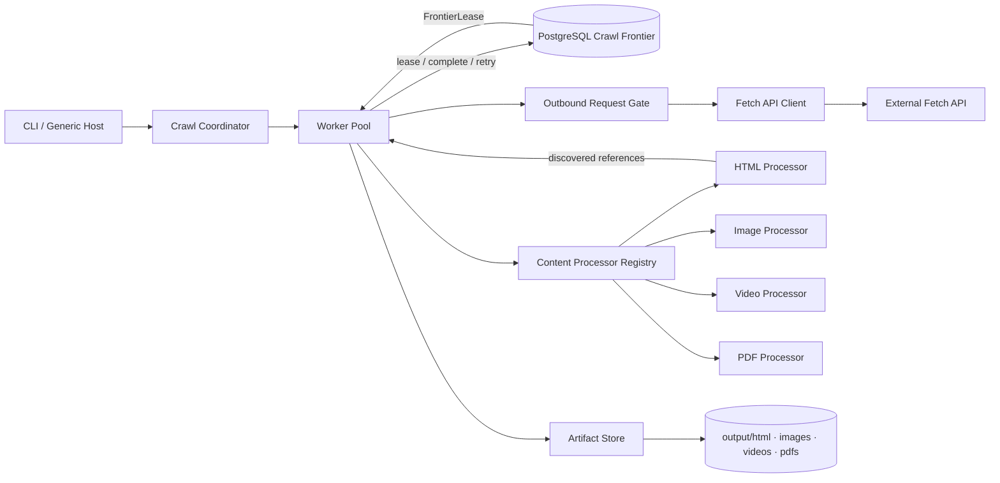

# BrightCrawler Architecture

## 1. Architecture decision

Build the crawler as a **pragmatic clean modular monolith** on .NET 10.

The production solution contains only three projects:

- `BrightCrawler.App` — executable host and composition root;
- `BrightCrawler.Core` — crawl workflow, frontier contracts, policies, and domain models;
- `BrightCrawler.Infrastructure` — PostgreSQL, Fetch API, filesystem, rate control, and content processors.

PostgreSQL acts as the **durable crawl frontier** and source of truth. Workers lease eligible URLs directly from PostgreSQL. There is no in-memory work queue, Redis, RabbitMQ, Kafka, MediatR, generic repository, or hidden HTTP retry pipeline.

This is intentionally smaller than a textbook Clean Architecture template. It preserves only the boundaries that protect correctness or enable a required extension.

## 2. Requirement-to-design mapping

| Assignment requirement | Architectural response |
|---|---|
| Seed URL and same-site crawling | Conservative URL canonicalization plus exact-host scope policy |
| Process each logical URL once under concurrency | Unique canonical URL identity per run plus exclusive lease token |
| HTML, images, videos, PDFs | MIME-based `IContentProcessor` registry with four implementations |
| Add a fifth content type without rewriting handlers | New processor + DI registration; orchestration remains unchanged |
| Persist state in a database | PostgreSQL stores runs, frontier entries, attempts, results, hashes, and links |
| Resumability | Pending/retry/leased states, expired-lease recovery, and `resume <run-id>` CLI |
| Rate control | Shared concurrency limit, token bucket, and `Retry-After` cooldown |
| Failure handling | Explicit terminal/transient outcome policy and persisted retry schedule |
| Observability | Structured logs, attempt history, frontier snapshots, and `status` command |
| Separate output directories | Content-addressed artifact paths below the four required roots |
| Lean implementation | One process, one database, one filesystem volume, focused parsing libraries only |

## 3. Core terminology

### Crawl frontier

The crawl frontier is the crawler's **durable scheduling component**. It knows:

- which canonical URLs have been discovered;
- which URLs are eligible now;
- which URLs are leased to workers;
- which URLs are deferred until a retry time;
- which URL should be selected next;
- whether the crawl has any unfinished work.

It is more than FIFO `enqueue/dequeue`: selection considers state, availability time, depth, priority, attempts, and leases.

### Active frontier versus crawl ledger

The same PostgreSQL table stores both concepts, but they are logically distinct:

```text
Active frontier
  pending
  leased
  retry_scheduled

Crawl ledger / terminal history
  succeeded
  redirected
  not_found
  blocked
  unsupported
  rejected
  invalid_content
  failed_permanent
```

The active frontier can grow or shrink. The set of known URL records usually grows monotonically during a run and remains as an inspectable ledger after completion.

## 4. System context



## 5. Concurrency and correctness

### Lease protocol

1. Worker calls `TryLeaseNextAsync` inside a transaction.
2. PostgreSQL selects the next eligible row with `FOR UPDATE SKIP LOCKED`.
3. Row transitions to `leased` with `lease_token`, `lease_owner`, and `lease_until`.
4. Worker fetches, processes, and finalizes with the same lease token.
5. Finalization succeeds only if the row is still `leased` with the matching token.

Expired leases are reclaimed automatically when another worker attempts to lease work.

### Replay safety

An HTTP fetch and a PostgreSQL commit cannot be atomic. If a worker crashes after a successful fetch but before commit, the URL may be fetched again on reclaim. Canonical URL identity and artifact hashing make replay safe without duplicating logical crawl state.

## 6. Resilience

| HTTP outcome | Policy |
|---|---|
| 200 with supported body | Process, persist artifact, discover links |
| 301/302 with `Location` | Follow within redirect budget |
| 403 / 404 | Terminal |
| 429 | Honor `Retry-After`, schedule durable retry, pause shared gate |
| 500 / timeout / network | Bounded exponential backoff with jitter |
| Unsupported MIME | Terminal `unsupported` |

Retries are explicit in application code. There is no hidden Polly/`HttpClient` retry pipeline.

## 7. Content processing

Processors are selected by normalized `Content-Type`:

| Processor | Metadata |
|---|---|
| HTML | Title, extracted reference count |
| Image | Width, height (JPEG/PNG/EXIF best effort), file size |
| Video | File size, duration (QuickTime header best effort) |
| PDF | Page count, title |

Artifacts are content-addressed under `output/html`, `output/images`, `output/videos`, and `output/pdfs`.

## 8. Resumability

Run state is durable in `crawl_runs` and `crawl_urls`:

- `Ctrl+C` marks an incomplete run as `paused`.
- `resume <run-id>` reloads stored options and counters, reopens the run, and continues leasing unfinished work.
- Budget counters (`known_url_count`, `downloaded_bytes`) are restored from PostgreSQL on resume.

## 9. Deliberate trade-offs

- **PostgreSQL frontier** instead of a broker at take-home scale avoids dual-write consistency problems.
- **Exact-host scope** instead of full public-suffix/robots enforcement keeps policy code small.
- **No JavaScript execution** — static HTML link extraction only.
- **Best-effort media metadata** — enough to demonstrate processor extensibility without shipping FFmpeg.
- **Polling workers** instead of `LISTEN/NOTIFY` — simpler and sufficient for the assignment scope.
- **Optional local Fetch API mock** — not required by the brief; added as a separate `mock-fetch-api` container for realistic manual testing while keeping the crawler's default pointed at the assignment black-box URL.

## 10. Production evolution

At moderate scale:

- Run multiple worker instances against the same lease protocol.
- Move artifacts to object storage.
- Add OpenTelemetry metrics and orphan artifact GC.
- Partition/index frontier tables by `crawl_run_id`.

Introduce a broker only when fetch and processing must scale independently, using an outbox/inbox handoff while PostgreSQL remains the scheduling source of truth.
